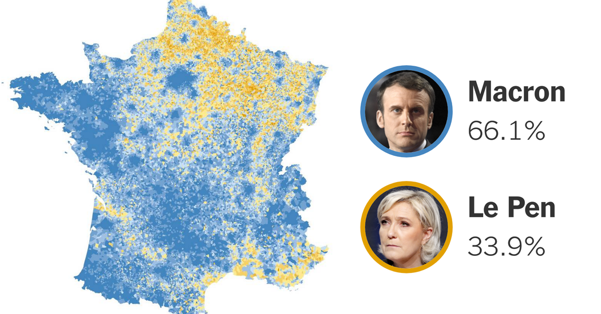
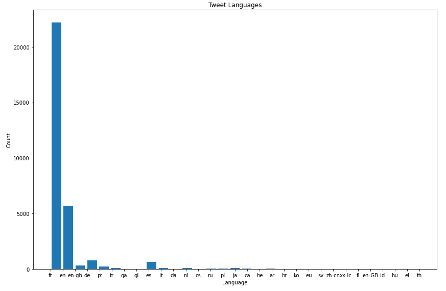
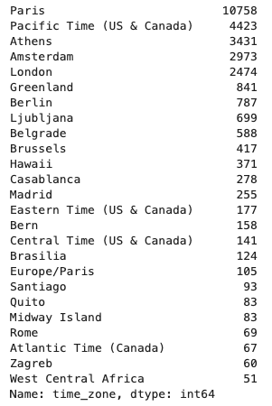
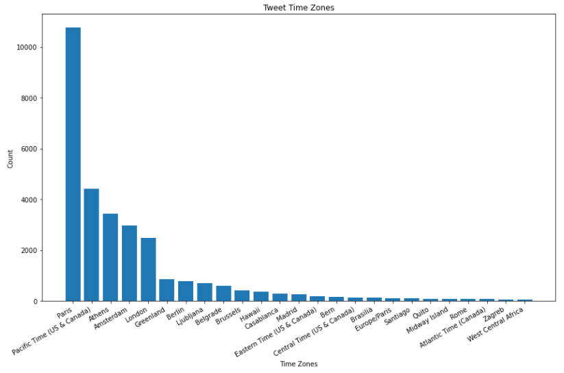
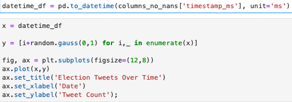
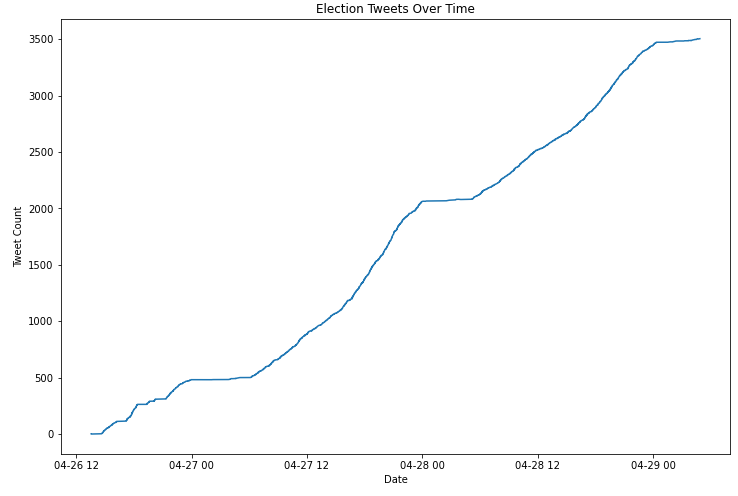
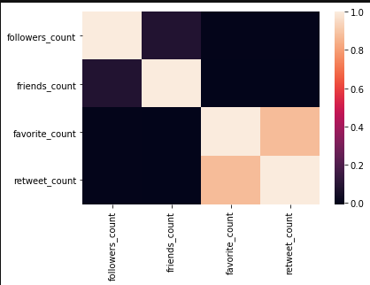
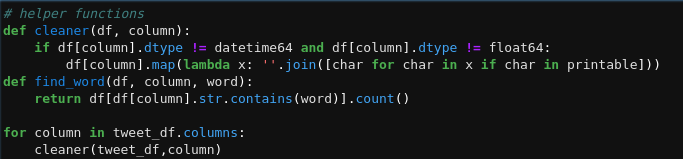

# Case Study

# French Election Tweets 

## Big Data 

After connecting to the dataset via spark, we noticed that there are intricate schema, so we narrowed it down to fewer features:

* columns we picked:   
    name, tweet(text), followers count, friends count, language, hashtags, time zone, time stamps, verified, retweet count, favorite count. 
* We only used 20% of samples from french_tweets.json. 

There were many null values so we dropped those rows given time constraints.  

Below we can see the  distribution of language used in French Tweets. 

Below are the top 25 time zones tweeted from. 

Below is the graph of the timezone mentioned above. 

Changed the date type from string to datetime object.

And plotted tweets over time. 
We can see that the tweets peaked at the end of April, which makes sense because the election concluded on May 7th. 

It still looks rough the correlation between friends and followers and between favorite and retweets make intuitive sense but there should be some correlation between favorite and retweets on followers. The first attempt at heatmap revealed that the key we pulled initially had no meaningful values. 

## What to do next

We have some difficulty to clean the text. We do come up with peice of helper function. We will work on to get it fully functional. 

 
